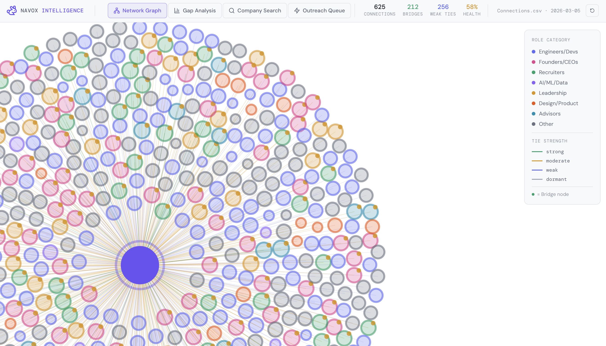

# Navox Network

**Map your professional network. Find your side door.**

> *"The people you barely know are more likely to get you a job than your best friends."*
> — Granovetter, 1973. Confirmed causally on 20 million LinkedIn users in 2022.


https://github.com/user-attachments/assets/5f607cf1-63ec-428b-9523-978420da0298




🔗 **<a href="https://navox.tech/network" target="_blank">Live Demo →</a>**

---

## The problem

You've been told to "network." Nobody told you that you already have one.

Even someone with 50 LinkedIn connections is sitting on thousands of shared-context paths they've never mapped. New graduates, immigrants, refugees, and career changers are told to build a network from scratch — but they're not starting from zero. They're nodes in a graph they've never been given a map to read.

Meanwhile, 30–50% of all hires happen through referrals. One referral is statistically equivalent to 40 cold applications. The referral economy is the real labor market. It's just invisible to the people who need it most.

Navox Network makes it visible.

---

## What it does

Upload your LinkedIn connections CSV. No login. No server. No data leaves your browser.

| View | What it answers |
|---|---|
| **Network Graph** | What does my network actually look like? |
| **Gap Analysis** | Where is my bridging capital weak? |
| **Company Search** | Who do I already know at this company? |
| **Outreach Queue** | Who should I contact this week, and what do I say? |

🔗 **<a href="https://navox.tech/network" target="_blank">Try it now →</a>** or run it locally below.

---

## How to get your LinkedIn data

1. LinkedIn → **Settings → Data Privacy**
2. Click **"Get a copy of your data"**
3. Select **Connections** only
4. Request archive → download when ready (up to 24h)
5. Upload `Connections.csv` to the tool

Your data is parsed entirely in your browser using [PapaParse](https://www.papaparse.com/). Nothing is sent to any server.

---

## Run locally

```bash
git clone https://github.com/navox-labs/network.git
cd network
npm install
npm run dev
```

Open [http://localhost:3000/network](http://localhost:3000/network) and upload your CSV.

**Requirements:** Node.js 18+

**After uploading:** Zoom into the graph and hover over nodes to see connection details. Check the **Outreach Queue** tab for who to message first and suggested opener messages by tie type.

---

## The science

This tool is a direct implementation of three bodies of research:

**Granovetter (1973, 1983) — The Strength of Weak Ties**
Weak ties — acquaintances, not close friends — provide non-redundant information about job opportunities because they inhabit different professional clusters. Your close circle recycles the same opportunities. Your peripheral contacts are the bridges.

**Rajkumar et al. (2022, Science) — Causal validation at scale**
A randomized experiment on 20 million LinkedIn users over 5 years, generating 2 billion new connections and 600,000 job placements. Result: weak ties causally increase job mobility. The most valuable connections are moderate-strength weak ties — former colleagues, shared-institution acquaintances — not strangers and not close friends.

**Putnam (2000) — Bridging vs. bonding capital**
Bonding capital (strong ties within a homogeneous group) provides support. Bridging capital (connections that cross group boundaries) provides access to new information, opportunities, and referrals. Job seekers typically have a bonding surplus and a bridging deficit. This tool measures both.

---

## Tie strength model

The previous model (recency-only) scored connections by how recently you connected. This is **backwards** relative to weak-ties theory — a connection from yesterday is likely a stranger; a connection from 3 years ago is an established relationship.

### New model — three components:

| Component | Weight | Logic |
|---|---|---|
| Relationship depth | 40% | Duration of connection, peaks at ~2 years |
| Bridging potential | 35% | Role category — Recruiters, Leadership, Founders rank highest |
| Recency signal | 25% | Active connection within last 6 months |

### Tie categories:

| Strength | Range | Meaning |
|---|---|---|
| Strong | 0.7–1.0 | Close colleagues, inner circle |
| Moderate | 0.4–0.69 | Meaningful professional relationship |
| **Weak** | **0.1–0.39** | **Granovetter's zone — highest job mobility value** |
| Dormant | 0.0–0.09 | Needs re-activation before outreach |

### Activation priority

Weak ties in bridge roles (Recruiters, Leadership, Founders, Advisors) rank **highest** in the outreach queue — not strong ties. Strong ties are already activated. Weak bridge ties are where the undiscovered opportunity lives.

---

## Stack

| | |
|---|---|
| Framework | Next.js 14 (App Router) |
| Graph | react-force-graph-2d (canvas, handles 1000+ nodes) |
| CSV parsing | PapaParse (runs in-browser) |
| Language | TypeScript throughout |
| Styling | CSS variables + Tailwind utilities |
| Backend | None |
| Database | None |
| Auth | None |

---

## Project structure

```
network/
├── app/
│   ├── page.tsx          # Main state orchestration
│   ├── layout.tsx        # Root layout + fonts
│   └── globals.css       # Design system (CSS variables)
├── components/
│   ├── UploadScreen.tsx  # CSV upload, drag-and-drop, export instructions
│   ├── TopBar.tsx        # Navigation + live network stats
│   ├── GraphView.tsx     # Force graph, filtering, node tooltips
│   ├── GapPanel.tsx      # Bridging capital analysis + gap recommendations
│   ├── CompanySearch.tsx # Company/role search with activation guidance
│   └── OutreachQueue.tsx # Ranked targets + draft messages by tie type
└── lib/
    └── tieStrength.ts    # Core model: tie strength, gap analysis, search, ranking
```

---

## Who this is built for

The populations most harmed by AI hiring systems are also the ones least equipped to access the referral economy that bypasses those systems:

- **New graduates** — rich in peer connections, poor in bridge connections to hiring authority
- **New immigrants** — existing professional network geographically mislocated; perceived as irrelevant, rarely is
- **Refugees** — simultaneous credential recognition, employment gap, and name-bias challenges in ATS systems
- **Career changers** — deep network from previous field treated as useless for new field; almost never true

This tool is built specifically around the insight that these populations are not starting from zero. They are starting from a node in a graph that is larger, more connected, and more navigable than they have been led to believe.

---

## Research

This tool implements findings from:

- Granovetter, M. (1973). The strength of weak ties. *American Journal of Sociology*, 78(6), 1360–1380.
- Granovetter, M. (1983). The strength of weak ties: A network theory revisited. *Sociological Theory*, 1, 201–233.
- Rajkumar, K., et al. (2022). A causal test of the strength of weak ties. *Science*, 377(6612), 1304–1310.
- Putnam, R. D. (2000). *Bowling Alone*. Simon & Schuster.
- Ryan, L. (2011). Migrants' social networks and weak ties. *The Sociological Review*, 59(4), 707–724.

Full citation list in the companion research paper: [The Invisible Network (Yousif, 2026)](https://navox.tech)

---

## Related

- [Navox Coach](https://github.com/navox-labs/coach) — AI coaching agent that plugs into your network analysis
- [navox.tech](https://navox.tech) — Create a customized AI voice-driven professional profile card to replace your resume — paste the link directly in your outreach messages

---

## License

MIT — see [LICENSE](LICENSE).

Built by [Navox Labs](https://navox.tech) · Research by Nahrin Yousif
